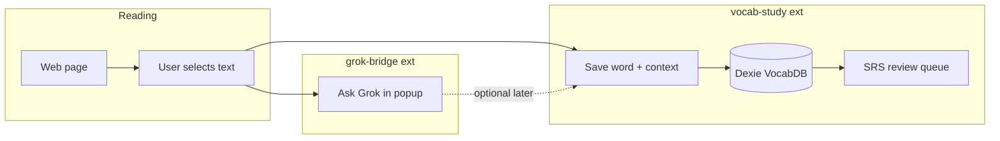

# High-value delivery plan (personal tool, lightweight monorepo)

## Recommendation: continue, but restructure—do not pause the idea

**Pause:** The current single extension ([`src/background.js`](src/background.js) ~911 lines, ~367 KB built) that bundles Grok + vocab + auto-extract + d3 + compromise + Dexie.

**Continue:** A **monorepo with 2 small extensions** optimized for daily use, low memory, and one clear learning loop.

**Only consider full archive** if after **Phase 2** (below) you still do not open the vocab extension 3+ times per week for 2 weeks—then the problem is habit/fit, not code.



---

## What delivers the most value (ranked)

| Priority | Deliverable | Why |
|----------|-------------|-----|
| 1 | **Recall-first review** (hide answer → reveal → grade → SM-2) | Only feature that builds retention; SM-2 already exists in [`src/background.js`](src/background.js) but Review UI shows answers immediately ([`src/vocab.js`](src/vocab.js) `showReviewCard`) |
| 2 | **Capture with context** (word + sentence + URL) | Matches how you actually read; schema has `sentences` but always `[]` |
| 3 | **Minimal Grok bridge** (selection → popup → API) | Already works; strip vocab weight |
| 4 | **On-demand extract only** | Remove [`src/vocab-extractor.js`](src/vocab-extractor.js) auto-run on every page (CPU + noise) |
| 5 | **Optional Grok→Save** (Phase 3) | Best integrated story without merging binaries |
| Defer | d3 graph, lunr, 9 languages, Datamuse relations, daily games | Cost without effectiveness today |

---

## Target architecture: monorepo, 2 lightweight extensions

```
ask-grok-extension/
├── package.json                 # workspaces
├── apps/
│   ├── grok-bridge/             # no Dexie, no compromise, no d3
│   │   ├── manifest.json
│   │   ├── src/background.js    # sendToGrok only
│   │   ├── src/popup.*
│   │   └── src/options.*
│   └── vocab-study/
│       ├── manifest.json
│       ├── src/background.js    # Dexie + SM-2 + capture (no Grok API)
│       ├── src/vocab.html/js    # single study UI
│       └── src/content.js       # optional: selection helper only
└── packages/
    └── shared/                  # chrome helpers, message types (tiny)
```

**Bundle budgets (personal use):**
- `grok-bridge`: popup + SW **&lt; 50 KB** (fetch + storage only)
- `vocab-study`: SW + vocab page **&lt; 200 KB** (Dexie + compromise on demand; **no full d3**, **no lunr**)

**Permissions:**
- Grok: `storage`, `activeTab`, `scripting`, `contextMenus`; host `https://api.x.ai/*`
- Vocab: `storage`, `activeTab`, `scripting`, `contextMenus`; **no** `<all_urls>` content script on every load

---

## Phase 0 — Split repo (half day)

- Add npm/pnpm workspaces; move current [`src/`](src/) into `apps/` via copy/split, not rewrite.
- Split [`src/background.js`](src/background.js): Grok half → `grok-bridge`; vocab half → `vocab-study`.
- One Vite config per app (pattern from [`vite.config.js`](vite.config.js)); drop vocab entries from grok build.
- Fix known bugs as part of split:
  - Unify Dexie **version 2** schema only in `vocab-study` (remove duplicate open in [`src/vocab.js`](src/vocab.js) v1).
  - Remove broken popup `d3` usage ([`src/popup.js`](src/popup.js) `createMiniGraph` without import).
  - Delete or disable auto [`vocab-extractor.js`](src/vocab-extractor.js) global extract.

**Pause from old repo:** combined popup vocab tab, mini-graph, bulk page auto-extract, Datamuse translation pipeline, relation batch insert (broken `related_id: null` in [`src/background.js`](src/background.js) ~484–558).

---

## Phase 1 — `grok-bridge` “daily driver” (1 day)

**Scope:** What already works in [`src/popup.js`](src/popup.js) + [`src/options.js`](src/options.js) + `sendToGrok`.

- Context menu: “Ask Grok about this” → popup with selection prefilled.
- Popup: prompt + optional page excerpt (cap 10k chars, existing behavior).
- Options: API key + model in `chrome.storage.local`.
- No vocab tab, no d3, no IndexedDB in this extension.

**Personal success:** You use it instead of opening grok.com for “what does this selection mean?”

---

## Phase 2 — `vocab-study` “effective v1” (2–3 days)

This is the high-value core. One study surface, one data writer (background SW).

### Data model (extend Dexie v3 in vocab app only)

Add to `words` (or `metadata`):
- `source_url`, `source_snippet` (sentence around word)
- `definition_en` (primary gloss for recall)
- Keep `translations` table optional later

Populate on capture:
- **Context menu** “Save word” (primary): selection + surrounding sentence from page via `scripting.executeScript`.
- **Optional** “Extract top words” button (manual): compromise in SW, top 5–10 only—not every navigation.

Definitions for v1 (pick one, in order of quality for personal use):
1. **Manual**: user edits gloss on save (fastest, always correct).
2. **Grok** (Phase 3): call xAI when key present.
3. Drop Datamuse-as-translation for v1 (unreliable).

### Single study flow (merge flashcards + review)

Replace separate flashcard/review UX in [`src/vocab.html`](src/vocab.html) with one **Review** mode:

1. Show: word (+ optional snippet, collapsed).
2. User thinks → **Reveal** definition.
3. Buttons: **Again (0)** | **Hard (1)** | **Good (3)** | **Easy (5)** → `updateWordReview` (existing SM-2 in background).
4. Queue: `getWordsDueForReview` only; show “X due today” on open.

**Remove for v1:** graph view, lunr search (use Dexie `words.where('text').startsWith`), multi-lang flash fields on card front.

### Relations

**Defer** synonym/antonym graph until capture + SRS feel good. Manual add can call existing `addRelations` later.

### Personal success criteria (2 weeks)

- Save 5–20 words/week from real reading with snippet + gloss.
- Complete due reviews most days; words move `new → learning → mature` in stats (`getReviewStats`).
- You trust definitions enough to grade honestly.

---

## Phase 3 — Thin cross-extension link (optional, 1 day)

Only if both extensions are installed daily:

- Grok popup button: **“Save to Vocab”** → `chrome.runtime.sendMessage` to vocab extension ID (config in options) with `{ word, snippet, url, grokExplanation }`.
- Vocab background: `addWordFromGrok` message handler → insert word + `definition_en`.

No shared IndexedDB (impossible across extensions); message payload is enough.

---

## Tech choices (final, aligned with lightweight goal)

| Library | grok-bridge | vocab-study |
|---------|-------------|-------------|
| Dexie | No | **Yes** (single owner: background) |
| compromise | No | **Yes**, manual extract only |
| lunr | No | **No** — Dexie prefix search |
| d3 | No | **No** for v1 |
| Datamuse | No | **No** for v1 |

---

## What to explicitly not do (saves energy)

- Chrome Web Store polish, privacy policy, marketing (personal unlisted is fine).
- [`cline-plan.txt`](cline-plan.txt) graph semantics, 9-language corpus, gamification, TB-IDF auto-corpus on every page.
- Third extension unless grok and vocab bundles still feel heavy after Phase 0–1 (unlikely).

---

## If it is still not worth continuing

Archive when **all** are true after Phase 2:
- You do not use `grok-bridge` for real questions for 2 weeks.
- You do not complete vocab reviews and deck size stays near zero.
- You prefer Readlang/Anki/Grok tab with zero integration friction.

In that case: keep `grok-bridge` as a 50-line weekend tool or archive entire repo; do not invest in monorepo Phase 3.

---

## Suggested implementation order

1. Phase 0 monorepo split + kill auto-extract + schema unify  
2. Phase 1 grok-bridge usable alone  
3. Phase 2 vocab-study effective v1 (capture + recall-first SRS)  
4. Dogfood 2 weeks → decide Phase 3 or archive  
5. Phase 3 Grok→Save only if dogfood passes  

Estimated effort: **~4–5 focused days** to personal daily-driver quality; **not** weeks of feature expansion.
