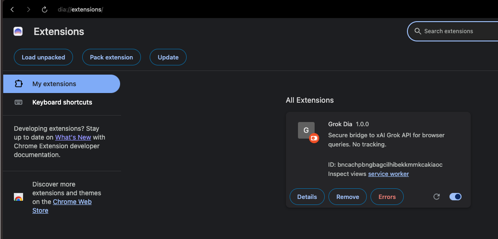
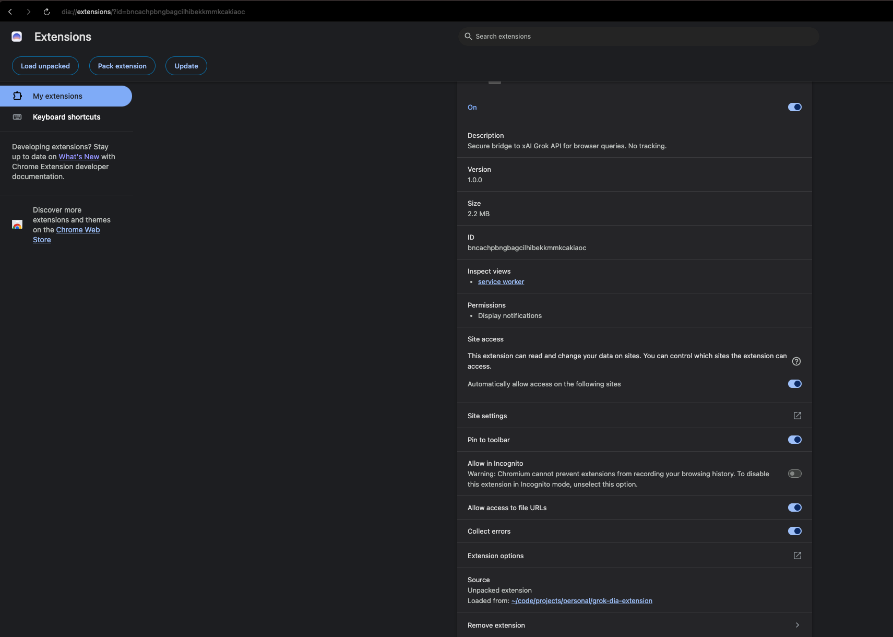
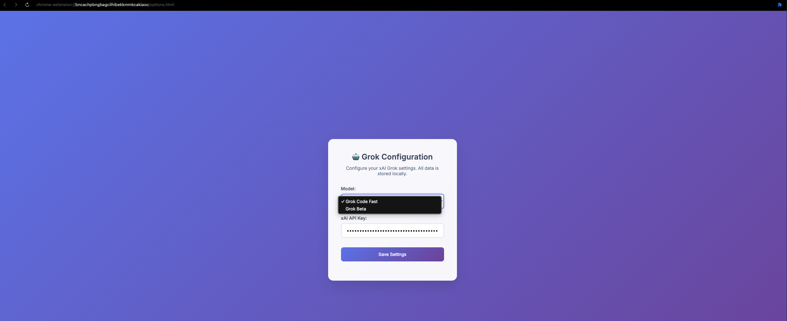
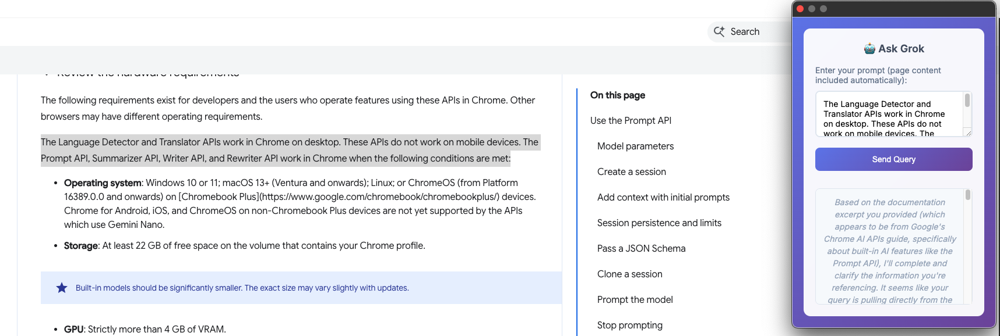
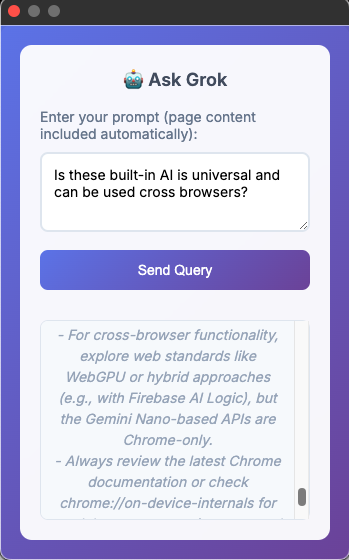

# Ask Grok Extension

**Secure bridge to xAI Grok API for browser queries. No tracking.**

Monorepo with two lightweight Chrome extensions for personal use:

| Extension | Folder | Purpose |
|-----------|--------|---------|
| **Grok Bridge** | [`apps/grok-bridge`](apps/grok-bridge) | Ask xAI Grok about selected text or the current page |
| **Vocab Study** | [`apps/vocab-study`](apps/vocab-study) | Save words with context; spaced-repetition review |

The legacy combined extension in [`src/`](src/) and [`extension/`](extension/) is deprecated.

## Features (Grok Bridge)

- Query xAI Grok AI directly from your browser with page context
- Right-click on selected text to "Ask Grok about this"
- Secure API key storage (local only)
- No data tracking or external logging
- Notifications for quick responses

## Installation

1. Download or clone this repository
2. Build extensions (see **Build** below)
3. Open Chrome and go to `chrome://extensions/`
4. Enable **Developer mode**
5. Click **Load unpacked** and select:
   - `apps/grok-bridge/dist`
   - `apps/vocab-study/dist` (optional, for vocabulary)

## Build

```bash
npm install
npm run build
```

## Usage (Grok Bridge)

1. **Configure Settings**: Click the extension icon, then **Options** to select your Grok model and enter your xAI API key
2. **Popup Query**: Click the extension icon, enter a prompt, and optionally include current page content
3. **Context Menu**: Select text on any webpage, right-click, and choose **Ask Grok about this**
4. Responses appear in the popup or as notifications

## Vocab Study

1. Click the extension icon to open the study page.
2. Right-click selection → **Save to Vocab Study** (word + sentence context + URL).
3. **Review** tab: reveal definition → Again / Hard / Good / Easy (SM-2).
4. **Add word** / **Extract from page** (manual, top 10 terms).

Add definitions in **Word list** → Edit def (or when saving manually).

## Link Grok → Vocab (optional)

Vocab Study works alone; skip this unless you use both extensions.

1. Install both extensions; copy **Grok Bridge** ID from `chrome://extensions`.
2. Run: `npm run link-extensions -- <grok-bridge-id>` (adds `externally_connectable` to the vocab manifest).
3. Reload Vocab Study on `chrome://extensions` (rebuild first if you changed code: `npm run build:vocab`).
4. In Grok Bridge options, paste **Vocab Study** extension ID.
5. After a Grok reply, use **Save to Vocab Study** in the popup.

## Configuration

Choose from available xAI Grok models:

- **Grok Code Fast**: Optimized for coding tasks
- **Grok Beta**: General purpose model

## Permissions

- **Storage**: To save your API key locally
- **Active Tab**: To access content from the current webpage for context
- **Scripting**: To extract page text for queries
- **Context Menus**: To add "Ask Grok" option on selected text
- **Notifications**: To display responses when using context menu

## Scripts

- `npm run build` — both extensions
- `npm run dev:grok` / `npm run dev:vocab` — watch builds
- `npm run link-extensions -- <grok-id>` — allow cross-extension save

## Dogfooding

See [`docs/DOGFOOD.md`](docs/DOGFOOD.md) for a 2-week personal checklist.

## Screenshots

### Configure API keys and select model

#### Click details



#### Click extension options



#### Select model and provide API key



### Select content and Ask Grok about this



### Open extension popup and ask anything (with page context)


