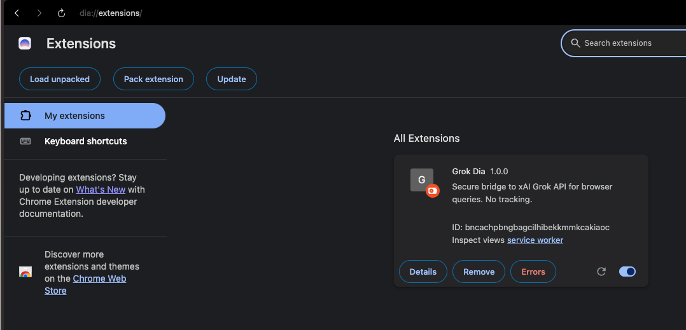
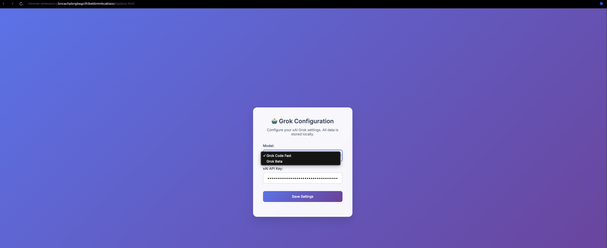

# Grok Dia

**Secure bridge to xAI Grok API for browser queries. No tracking.**

## Features
- Query xAI Grok AI directly from your browser with page context
- Right-click on selected text to "Ask Grok about this"
- Secure API key storage (local only)
- No data tracking or external logging
- Notifications for quick responses

## Installation
1. Download or clone this repository
2. Open Chrome and go to `chrome://extensions/`
3. Enable "Developer mode" in the top right
4. Click "Load unpacked" and select the `grok-dia-extension` folder
5. The extension will be installed and ready to use

## Usage
1. **Configure Settings**: Click the extension icon, then "Options" to select your Grok model and enter your xAI API key
2. **Popup Query**: Click the extension icon, enter a prompt, and optionally include current page content
3. **Context Menu**: Select text on any webpage, right-click, and choose "Ask Grok about this"
4. Responses will appear in the popup or as notifications

## Configuration
Choose from available xAI Grok models:
- **Grok Code Fast**: Optimized for coding tasks
- **Grok Beta**: General purpose model

## Permissions
- **Storage**: To save your API key locally
- **Active Tab**: To access content from the current webpage for context
- **Scripting**: To extract page text for queries
- **Context Menus**: To add "Ask Grok" option on selected text
- **Notifications**: To display responses when using context menu

## Screenshots

## Configure API keys and select model

### Click details

### Click extension options

### Select model and provide API key

### Select content and `Ask Grok about this` feature

### Open extension popup and ask anything

with page context

